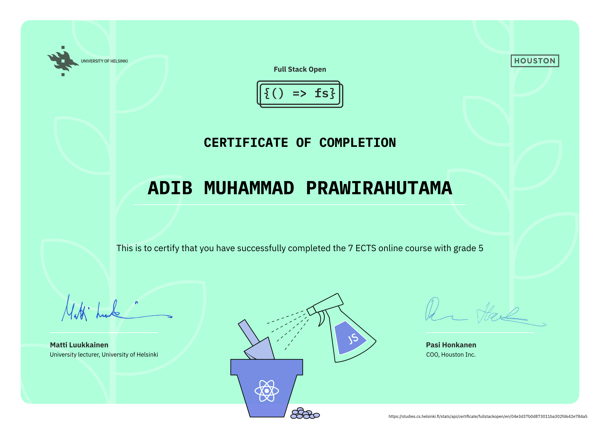

# Full Stack Open — Completed

<p align="center">
  
</p>

**Adib MP** — Full Stack Web Development, University of Helsinki

Course: [fullstackopen.com](https://fullstackopen.com)

---

## About

This repository contains all my exercise submissions for the **Full Stack Open** course by the University of Helsinki. The course is a deep dive into modern web development, covering everything from single-page applications to backend services, databases, testing, and deployment.

---

## What I Learned

### Part 0 — Fundamentals of Web Apps
Web application architectures, HTTP protocol, traditional vs. single-page applications, sequence diagrams for browser-server communication.

### Part 1 — Introduction to React
React components, JSX, component state, event handling, passing props, conditional rendering, debugging React apps.

### Part 2 — Communicating with Server
Fetching data from REST APIs with Axios, rendering collections, controlled forms, CSS styling, working with external APIs (REST Countries).

### Part 3 — Programming a Server with Node.js and Express
Building REST APIs with Express, middleware, MongoDB with Mongoose, validation, error handling, deploying to production.

### Part 4 — Testing and Backend Administration
Unit and integration testing with Jest and Supertest, user authentication with bcrypt and JSON Web Tokens, authorization middleware.

### Part 5 — Testing and Improving the Frontend
Login forms and token storage, conditional rendering, React testing with Vitest and React Testing Library, end-to-end testing with Playwright.

### Part 6 — Advanced State Management
Flux architecture, Redux with Redux Toolkit (`createSlice`, `createAsyncThunk`), React Query for server state, uncontrolled forms with `useRef`.

### Part 7 — React Router, Custom Hooks, CSS, and More
Client-side routing with React Router, custom React hooks, CSS frameworks and styling, Webpack configuration, extending full-stack applications.

---

## Tech Stack

| Layer | Technologies |
|---|---|
| **Frontend** | React, Redux, React Query, React Router, Material UI (M3) |
| **Backend** | Node.js, Express |
| **Database** | MongoDB, Mongoose |
| **Testing** | Vitest, React Testing Library, Playwright, Jest, Supertest |
| **Tooling** | Vite, ESLint, Prettier, Webpack |

---

## Repository Structure

```
├── part0/       # Web app fundamentals & diagrams
├── part1/       # React basics
├── part2/       # Communicating with server
├── part3/       # Node.js, Express, MongoDB
├── part4/       # Testing, auth (backend)
├── part5/       # Testing, auth (frontend + E2E)
├── part6/       # Redux, React Query
└── part7/       # React Router, hooks, styling, extensions
```
