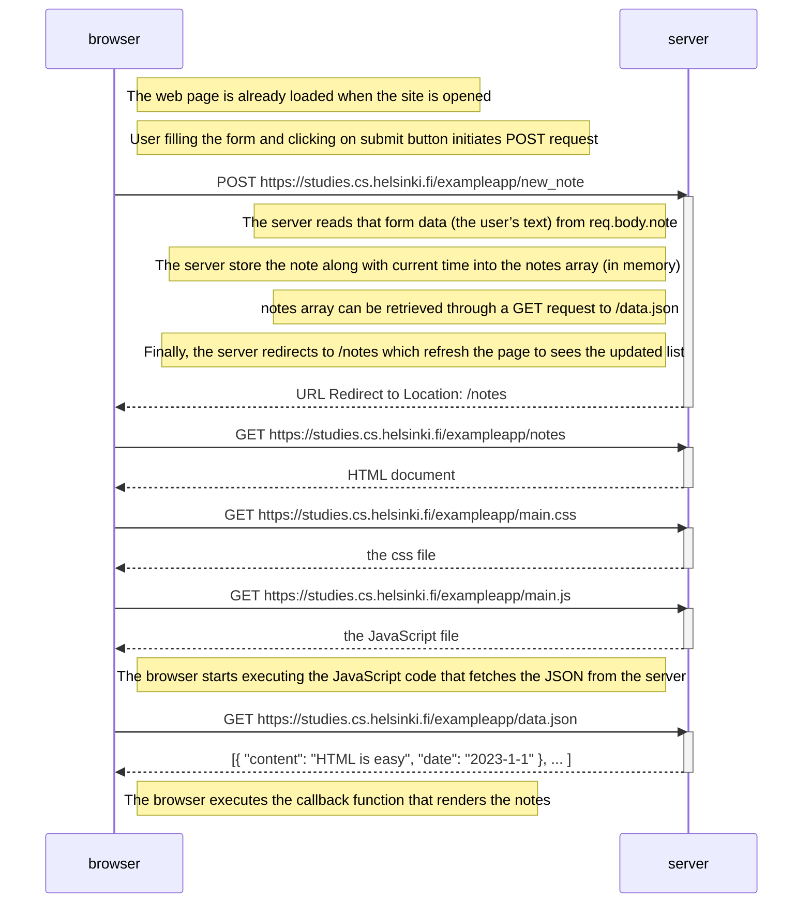

```mermaid
sequenceDiagram
    participant browser
    participant server

    Note right of browser:The web page is already loaded when the site is opened
    Note right of browser:User filling the form and clicking on submit button initiates POST request
    browser->>server: POST https://studies.cs.helsinki.fi/exampleapp/new_note
    activate server
    Note left of server: The server reads that form data (the user’s text) from req.body.note
    Note left of server: The server store the note along with current time into the notes array (in memory)
    Note left of server: notes array can be retrieved through a GET request to /data.json 
    Note left of server: Finally, the server redirects to /notes which refresh the page to sees the updated list

    server-->>browser: URL Redirect to Location: /notes
    deactivate server

    browser->>server: GET https://studies.cs.helsinki.fi/exampleapp/notes
    activate server
    server-->>browser: HTML document
    deactivate server

    browser->>server: GET https://studies.cs.helsinki.fi/exampleapp/main.css
    activate server
    server-->>browser: the css file
    deactivate server

    browser->>server: GET https://studies.cs.helsinki.fi/exampleapp/main.js
    activate server
    server-->>browser: the JavaScript file
    deactivate server

    Note right of browser: The browser starts executing the JavaScript code that fetches the JSON from the server

    browser->>server: GET https://studies.cs.helsinki.fi/exampleapp/data.json
    activate server
    server-->>browser: [{ "content": "HTML is easy", "date": "2023-1-1" }, ... ]
    deactivate server

    Note right of browser: The browser executes the callback function that renders the notes
```
