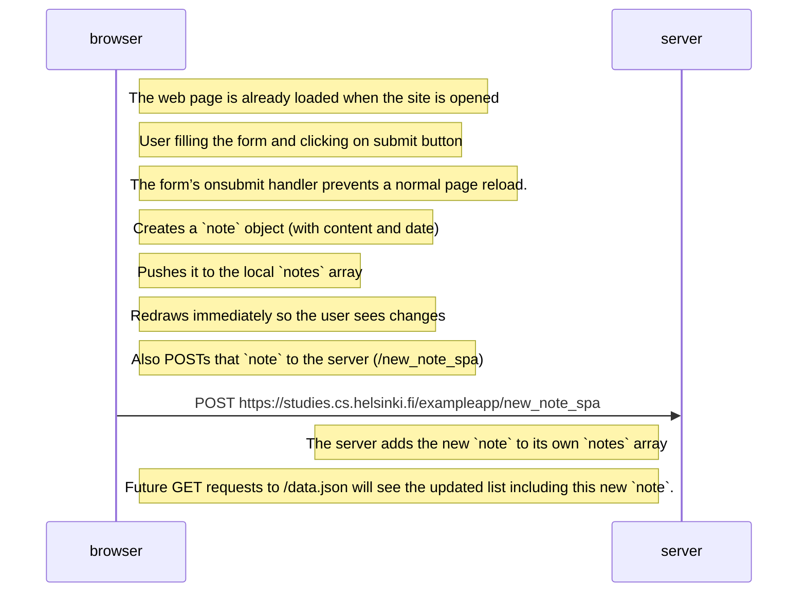

```mermaid
sequenceDiagram
    participant browser
    participant server

    Note right of browser:The web page is already loaded when the site is opened
    Note right of browser:User filling the form and clicking on submit button
    Note right of browser:The form’s onsubmit handler prevents a normal page reload.
    Note right of browser:Creates a `note` object (with content and date)
    Note right of browser:Pushes it to the local `notes` array
    Note right of browser:Redraws immediately so the user sees changes
    Note right of browser:Also POSTs that `note` to the server (/new_note_spa)

    browser->>server: POST https://studies.cs.helsinki.fi/exampleapp/new_note_spa
    activate server
    Note left of server:The server adds the new `note` to its own `notes` array
    Note left of server:Future GET requests to /data.json will see the updated list including this new `note`.
```
